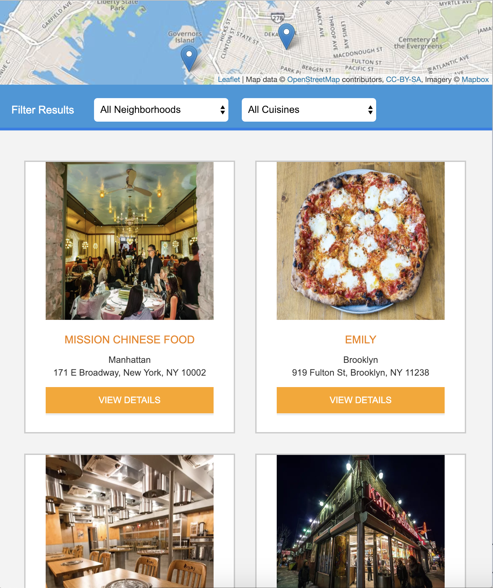
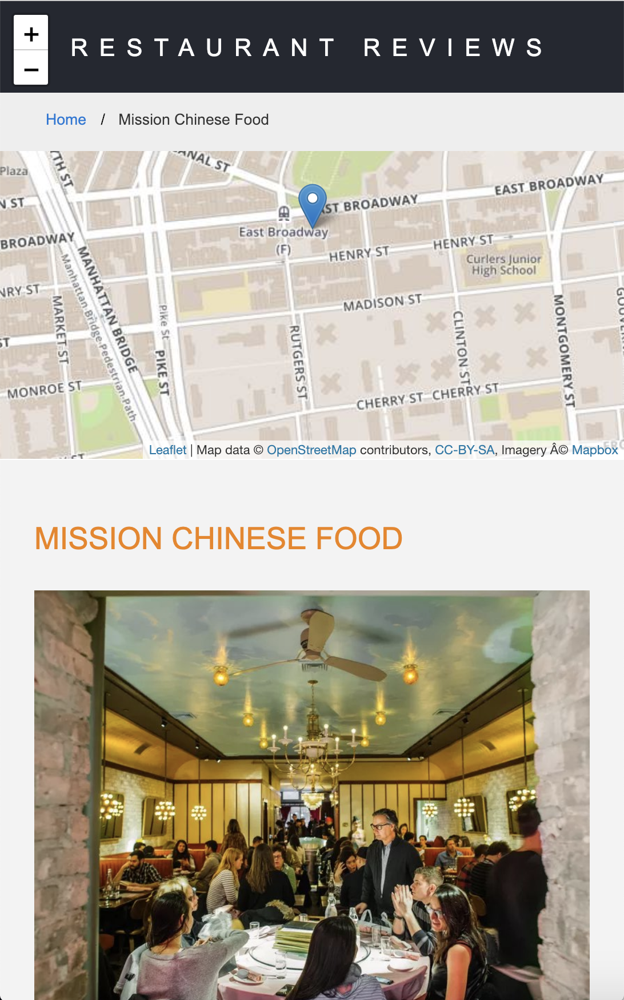

# Restaurants Reviews (Udacity Project)
This is the fifth and final project from Udacity Front-end Development Nanodegree.

### Design of the main page in desktop

### Design of the main page in mobile

### Design of the specific restaurant page in desktop

### Design of the specific restaurant page in mobile

## Project Explanation
For the **Restaurant Reviews** project: 
- Convert a static webpage to a mobile-ready web application and convert the design to be responsive on different sized displays.
- Add accessibility to be usable for screen reader use. 
- Add a service worker to begin the process of creating a seamless offline experience for the users.

### How to run the project
1. Run the command `git clone https://github.com/cesar18pena/restaurant-reviews.git `
2. Check your python version running the command `python -V`
3. Start running your local server:
3.1 If you have python 2.x: `python -m SimpleHTTPServer 8000`
3.2 If you have python 3.x: `python3 -m http.server 8000`
4. With your server running, visit the site: `http://localhost:8000`

### Note about ES6
Most of the code in this project has been written to the ES6 JavaScript specification for compatibility with modern web browsers and future-proofing JavaScript code. As much as possible,try to maintain use of ES6 in any additional JavaScript you write.
